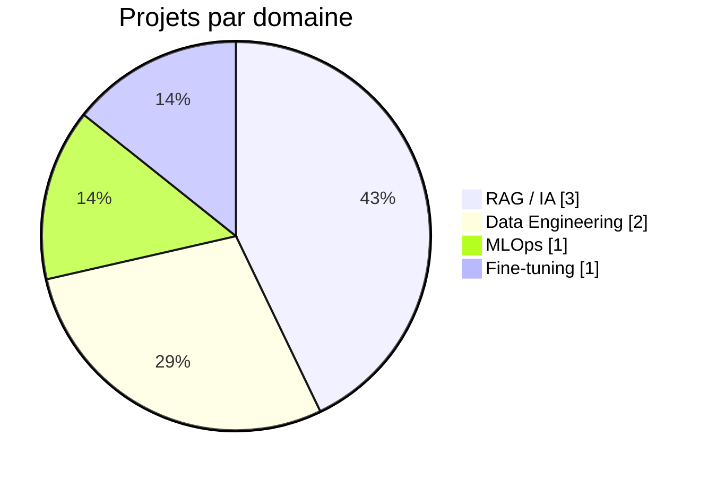

# 📊 Rapport de projets — Franklin KANA NGUEDIA

> **Data Engineer & AI Engineer** · Airflow · Spark · Azure/Databricks · RAG · Neo4j · LLMOps
> Rapport généré à des fins de test — synthèse de tous les projets du portfolio.

---

## 🗂️ Vue d'ensemble

| # | Projet | Domaine | Stack clé | Date | Statut |
|---|--------|---------|-----------|------|:------:|
| 1 | [RAG fiable & traçable (URSSAF)](#1--rag-fiable-traçable-et-auditable-urssaf) | RAG / IA | Neo4j · Ollama · FastAPI · React | 2025-10 | ✅ |
| 2 | [Spécialisation de LLM métier](#2--spécialisation-de-llm-pour-domaines-métiers) | Fine-tuning | Qwen · LoRA · Unsloth · HF | 2026-01 | ✅ |
| 3 | [Agent SQL pour équipes métier](#3--agent-sql-pour-équipes-métier) | LLM / Data | LLaMA · FastAPI · PostgreSQL · Docker | 2026-02 | ✅ |
| 4 | [MLOps médical (Kubeflow)](#4--mlops-médical--industrialisation-de-lia) | MLOps | Jenkins · Kubeflow · K8s | 2026-03 | ✅ |
| 5 | [Airflow Learning & Projects](#5--airflow-learning--projects) | Data Eng. | Airflow · Pandas · Parquet | 2026-03 | ✅ |
| 6 | [Pipeline e-commerce temps réel](#6--pipeline-e-commerce-temps-réel-sur-azure) | Data Eng. | Azure · Databricks · Synapse · Power BI | 2026-04 | ✅ |
| 7 | [Chatbot RAG documentaire](#7--chatbot-rag-sur-base-documentaire) | RAG / IA | LangChain · FastAPI · Vector DB | 2026-05 | ✅ |

**Total : 7 projets** — 3 RAG/LLM · 2 Data Engineering · 1 MLOps · 1 Fine-tuning

---

## 🧭 Frise chronologique

> Version markdown pure (rendu identique GitHub + Astro, zéro dépendance).

**●　2025-10 · RAG fiable & traçable**
`IA / RAG` — Citations sources, deep-linking PDF, anti-hallucination. Neo4j + Ollama.

`　│`

**●　2026-01 · Spécialisation de LLM métier**
`Fine-tuning` — LoRA + Unsloth sur Qwen2.5, quantification 4-bit, déploiement HF + Ollama.

`　│`

**●　2026-02 · Agent SQL équipes métier**
`LLM / Data` — Langage naturel → SQL → réponse, lecture seule sécurisée.

`　│`

**●　2026-03 · MLOps médical**
`MLOps` — CI/CD ML, Kubeflow, monitoring temps réel, rollback instantané.

`　│`

**●　2026-03 · Airflow Learning & Projects**
`Data Eng.` — DAG Yahoo Finance, ETL, qualité des données, observabilité.

`　│`

**●　2026-04 · Pipeline e-commerce temps réel**
`Data Eng.` — Architecture médaillon Bronze/Silver/Gold sur Azure.

`　│`

**●　2026-05 · Chatbot RAG documentaire**
`IA / RAG` — Ingestion + indexation vectorielle + requêtes LangChain.

---

## 📁 Fiches détaillées

### 1. 🔎 RAG fiable, traçable et auditable (URSSAF)

 

| | |
|---|---|
| **Objectif** | Système RAG de haute précision avec réponses sourcées et vérifiables. |
| **Stack** | FastAPI · Ollama (Mistral 7B, nomic-embed-text) · Neo4j · React · Docker · Prometheus/Grafana |
| **Points forts** | Deep-linking vers la page PDF (`#page=XX`), surlignage dynamique, monitoring des hallucinations. |
| **Code** | <https://github.com/fkdia23/RAG---Deep-Linking-Search> |

---

### 2. 🧠 Spécialisation de LLM pour domaines métiers

 

| | |
|---|---|
| **Objectif** | Adapter un LLM généraliste à un vocabulaire métier, léger et déployable localement. |
| **Stack** | Qwen2.5-Coder-0.5B (4-bit) · LoRA/PEFT · Unsloth + TRL · Transformers · Ollama |
| **Points forts** | Entraînement ~2× plus rapide, déploiement hybride HF (gated) + local. |
| **Modèle** | <https://huggingface.co/fknguedia/qwen_2.5_coder_sqlagent_pilot> |

---

### 3. 💬 Agent SQL pour équipes métier

 

| | |
|---|---|
| **Objectif** | Permettre aux non-techniciens d'interroger PostgreSQL en langage naturel. |
| **Stack** | FastAPI · LLaMA · PostgreSQL · Gradio · Docker |
| **Points forts** | Langage naturel → SQL → réponse, validation lecture seule, logs d'audit. |
| **Code** | <https://github.com/fkdia23/text-to-sql-to-text> |

---

### 4. ⚙️ MLOps médical — industrialisation de l'IA

 

| | |
|---|---|
| **Objectif** | Automatiser tout le cycle de vie des modèles IA en contexte médical. |
| **Stack** | Jenkins · Kubeflow · Kubernetes · monitoring temps réel |
| **Points forts** | CI/CD ML, détection de drift, rollback instantané, fiabilité 24/7. |
| **Code** | <https://github.com/fkdia23/kubeflow> |

---

### 5. 🌀 Airflow Learning & Projects

 

| | |
|---|---|
| **Objectif** | Orchestration ETL fiable et observable autour d'Apache Airflow. |
| **Stack** | Apache Airflow · Python/Pandas · Parquet · API Yahoo Finance |
| **Points forts** | Collecte quotidienne automatisée, reprise sur erreur, validation de schéma. |
| **Code** | <https://github.com/fkdia23/airflow-yahoo-finance-analyze-StockMarket> |

---

### 6. ☁️ Pipeline e-commerce temps réel sur Azure

 

| | |
|---|---|
| **Objectif** | Pipeline Big Data temps réel, de la source on-premise aux dashboards. |
| **Stack** | Azure Data Factory · ADLS Gen2 · Databricks (Spark) · Synapse · Power BI |
| **Points forts** | Architecture médaillon Bronze/Silver/Gold, gouvernance AAD + Key Vault. |
| **Code** | <https://github.com/fkdia23/az_dataEngineer_E2E> |

---

### 7. 📚 Chatbot RAG sur base documentaire

 

| | |
|---|---|
| **Objectif** | Interroger une documentation dense (PDF) en langage naturel. |
| **Stack** | FastAPI · LangChain · Vector DB · PostgreSQL · Docker |
| **Points forts** | RAG end-to-end modulaire et conteneurisé, prêt à intégrer un SI. |
| **Code** | <https://github.com/fkdia23/rag_project> |

---

## 📈 Répartition par domaine

---

## 🔗 Liens

- **Portfolio** : <https://fkdia23.github.io>
- **GitHub** : <https://github.com/fkdia23>
- **LinkedIn** : <https://www.linkedin.com/in/franklin-kana-nguedia>
- **Contact** : fknguedia@gmail.com

Rapport de démonstration — généré le 2026-06-25.
