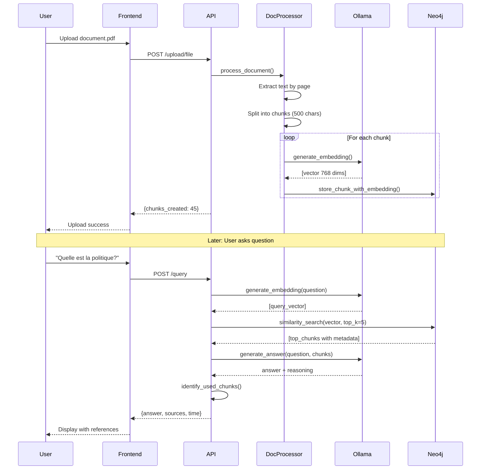

Comment l'URSSAF peut révolutionner sa gestion documentaire avec un système RAG de haute précision
Étude de cas : Transformer 60 ans d'archives réglementaires en assistant intelligent pour 45,000 collaborateurs

*« J’ai conçu un système RAG de haute précision avec traçabilité visuelle, initialement pour des données techniques complexes. Je suis convaincu qu’il répond à un besoin critique de l’URSSAF : permettre aux agents de s’appuyer sur une IA générative fiable, auditable et conforme pour interpréter la réglementation sociale.

Ce prototype intègre déjà les piliers demandés : ingestion de documents non structurés, retrieval précis avec métadonnées (page, document), génération sourcée, monitoring des hallucinations, et feedback utilisateurs.

En tant que Data Engineer IA, je souhaite contribuer à industrialiser ce type de solution au sein de la Fabrique, en collaboration avec les Data Scientists et les métiers, pour transformer la donnée réglementaire en levier de qualité du service public. »*

Démo :
Code source : 

## Table of contents

## **1. Le Défi : Pourquoi les réponses génériques ne suffisvent pas pour des données techniques complexes**

- **Contexte** : Dans les domaines techniques (ingénierie, recherche, santé, droit), les utilisateurs ont besoin de **réponses exactes**, souvent **sourcées** et **vérifiables**.
- **Limites des chatbots classiques** :
  - Réponses hallucinées ou trop génériques
  - Aucune traçabilité vers la source
  - Incapacité à justifier une affirmation par un extrait précis
- **Conséquence** : Perte de confiance, inutilisabilité dans des contextes critiques (audit, support technique, recherche)
- **Objectif du projet** : Aller au-delà de la simple génération → **répondre avec précision** (*precision*) **et prouvabilité** (*provenance*).


## **2. La Solution Prototype : Un RAG qui cite, surligne et renvoie à la source**

💡 La Solution : Un RAG sur mesure pour l'URSSAF
Vision : L'assistant réglementaire intelligent
Imaginons CLARA (Conseiller Législatif et Réglementaire Augmenté), un système RAG pensé spécifiquement pour l'URSSAF.

- **Fonctionnalités clés du prototype** :
  - Réponse générée **avec citation explicite** : nom du document, auteur, section/page
  - **Surlignage dynamique** du passage source dans le texte original
  - **Deep linking** vers la page exacte du PDF source (ex: `#page=42`)
- **Expérience utilisateur** : L’utilisateur voit non seulement *quoi*, mais aussi *d’où* vient l’information → transparence totale.
- **Cas d’usage illustratif** : Exemple concret (ex: ingénieur cherchant une spécification dans un manuel technique de 300 pages).

### 2.1 Workflow Utilisateur

```
┌─────────────────────────────────────────────────────────────────┐
│                    1. INGESTION                                  │
│  Utilisateur → Upload Documents → Traitement → Neo4j             │
│  (PDF, DOCX, TXT, URL)                                          │
└─────────────────────────────────────────────────────────────────┘
                              ↓
┌─────────────────────────────────────────────────────────────────┐
│                    2. EMBEDDING                                  │
│  Texte → Chunks → Ollama (nomic-embed-text) → Vecteurs         │
│  Stockage avec métadonnées (page, position)                     │
└─────────────────────────────────────────────────────────────────┘
                              ↓
┌─────────────────────────────────────────────────────────────────┐
│                    3. REQUÊTE                                    │
│  Question → Embedding → Recherche similaire → Top-K chunks      │
│  Similarité cosine > 0.5                                        │
└─────────────────────────────────────────────────────────────────┘
                              ↓
┌─────────────────────────────────────────────────────────────────┐
│                    4. GÉNÉRATION                                 │
│  Chunks + Question → LLM (Mistral) → Réponse contextuelle       │
│  Avec citations et références précises                          │
└─────────────────────────────────────────────────────────────────┘
                              ↓
┌─────────────────────────────────────────────────────────────────┐
│                    5. PRÉSENTATION                               │
│  Réponse + Sources (Fichier, Page, Texte surligné)             │
│  Interface React interactive                                    │
└─────────────────────────────────────────────────────────────────┘
```

---

## **3. L’Architecture : Choix techniques pour la précision et la traçabilité**

- **Stratégie de chunking** :
  - Découpage en **blocs de 500 caractères avec overlap de 50** pour préserver le contexte
  - Enrichissement systématique par **métadonnées** : nom du fichier, numéro de page, position dans le document
- **Base vectorielle** :
  - Utilisation de **Neo4j** (version 5.14+) pour sa capacité native à combiner **graphe + embeddings**
  - Stockage des vecteurs dans des propriétés de nœuds `Chunk`, avec index vectoriel optimisé (`gds.similarity.cosine`)
- **Modèle d’embedding** :
  - `nomic-embed-text` (via Ollama) : 768 dimensions, multilingue, performant sur le retrieval
- **Deep Linking vers le PDF** :
  - Extraction du texte **page par page** avec `PyMuPDF`
  - Génération d’URL de la forme `document.pdf#page=XX` à partir du numéro de page stocké dans les métadonnées
  - Restitution directe dans l’interface utilisateur pour navigation instantanée

### 3.1 Stack Technique Sélectionnée

- **Backend** : FastAPI (Python 3.11), asynchrone, avec validation Pydantic
- **LLM local** : Ollama (Mistral 7B pour génération, nomic-embed-text pour embeddings)
- **Stockage** : Neo4j pour documents, chunks, embeddings et relations
- **Frontend** : React 18 + TailwindCSS + PDF.js pour le surlignage et le deep linking
- **Infra** : Docker Compose (Neo4j, Ollama, Backend, Frontend, Prometheus, Grafana)
- **Gestion des dépendances** : `uv` (remplacement ultra-rapide de pip)

---


```
┌────────────────────────────────────────────────────────────────────┐
│                         COUCHE PRÉSENTATION                         │
│  ┌──────────────────────────────────────────────────────────────┐  │
│  │  React 18 + TailwindCSS                               │  │
│  │  - Chat Interface                                            │  │
│  │  - Document Upload                                           │  │
│  │  - Source Reference Viewer                                   │  │
│  └──────────────────────────────────────────────────────────────┘  │
└────────────────────────────────────────────────────────────────────┘
                              ↕ HTTP/REST
┌────────────────────────────────────────────────────────────────────┐
│                          COUCHE API                                 │
│  ┌──────────────────────────────────────────────────────────────┐  │
│  │  FastAPI (Python 3.11)                                       │  │
│  │  - REST Endpoints                                            │  │
│  │  - Upload Management                                         │  │
│  │  - Query Processing                                          │  │
│  │  - Prometheus Metrics                                        │  │
│  └──────────────────────────────────────────────────────────────┘  │
└────────────────────────────────────────────────────────────────────┘
                              ↕
┌────────────────────────────────────────────────────────────────────┐
│                       COUCHE SERVICES                               │
│  ┌─────────────────┐  ┌─────────────────┐  ┌──────────────────┐   │
│  │  RAG Service    │  │ Doc Processor   │  │  Neo4j Service   │   │
│  │  - Query        │  │ - Extract       │  │  - Store         │   │
│  │  - Search       │  │ - Chunk         │  │  - Search        │   │
│  │  - Generate     │  │ - Embed         │  │  - Retrieve      │   │
│  └─────────────────┘  └─────────────────┘  └──────────────────┘   │
└────────────────────────────────────────────────────────────────────┘
                ↕                    ↕                    ↕
┌──────────────────┐  ┌──────────────────┐  ┌──────────────────────┐
│   Ollama (LLM)   │  │  Neo4j (Graph)   │  │  Prometheus/Grafana  │
│  - Mistral       │  │  - Documents     │  │  - Metrics           │
│  - nomic-embed   │  │  - Chunks        │  │  - Dashboards        │
└──────────────────┘  └──────────────────┘  └──────────────────────┘
```

### 3.2 Stack Technique Détaillée

#### Backend

```yaml
Language: Python 3.11+
Framework: FastAPI 0.104+
Package Manager: UV (ultra-fast pip alternative)

Core Libraries:
  - langchain: Orchestration RAG
  - neo4j: Driver base de données
  - ollama: Interface LLM local
  - pypdf: Extraction PDF
  - python-docx: Extraction Word
  - chardet: Détection encodage UTF-8
  - prometheus-client: Métriques

Dependencies:
  - pydantic: Validation données
  - aiofiles: Async file operations
  - uvicorn: ASGI server
```

#### Frontend

```yaml
Framework: React 18
Build Tool: Vite 5
Styling: TailwindCSS 3
HTTP Client: Axios

Features:
  - Real-time chat interface
  - Drag & drop file upload
  - Source highlighting
  - Responsive design
```

#### Infrastructure

```yaml
Orchestration: Docker Compose
Containers:
  - Neo4j 5.14 (Community)
  - Ollama (Latest)
  - FastAPI Backend
  - React Frontend
  - Prometheus
  - Grafana

Storage:
  - neo4j_data: Graph persistence
  - ollama_data: Models cache
  - uploads: Document storage
```

### 3.3 Flux de Données



---

## **4. Approche End-to-End : Du document brut à l’interface utilisateur**

Le système suit un pipeline linéaire et observable :

1. **Ingestion** : L’utilisateur dépose un document (PDF, DOCX, etc.). Le backend extrait le texte **page par page**.
2. **Prétraitement** : Le texte est découpé en chunks de 500 caractères (50 de chevauchement) et enrichi avec :
   - `filename`, `page_number`, `start_char`, `end_char`
3. **Vectorisation** : Chaque chunk est transformé en vecteur via `nomic-embed-text` et stocké dans Neo4j avec ses métadonnées.
4. **Requête** : À chaque question, le système :
   - Convertit la requête en vecteur
   - Interroge Neo4j pour les chunks les plus similaires (seuil cosine > 0.5)
   - Récupère les extraits + métadonnées complètes
5. **Génération** : Le LLM (Mistral) reçoit la question + les chunks pertinents et génère une réponse **avec citations intégrées**.
6. **Présentation** : L’interface affiche :
   - La réponse synthétique
   - Les sources : nom du fichier, page, extrait surligné
   - Un lien cliquable (`#page=XX`) ouvrant directement la page du PDF

Cette chaîne garantit **reproductibilité**, **traçabilité** et **expérience utilisateur transparente**.
### 4.1. Justification des Choix Techniques

#### 4.1.1 Pourquoi Neo4j (Base de Données Graph) ?

**Avantages pour le RAG:**

1. **Relations Naturelles**
    ```cypher
	 (Document)-[:CONTAINS]->(Chunk)-[:RELATES_TO]->(Concept)
    ```
    - Modélisation intuitive des relations document-chunk
    - Traversée rapide pour trouver documents connexes
    - Extension future : graphe de connaissances (entités, concepts)
    
2. **Recherche Vectorielle Native**
    
    ```cypher
    // Neo4j 5.x supporte les embeddings
    MATCH (c:Chunk)
    WITH c, gds.similarity.cosine(c.embedding, $query_vector) AS score
    WHERE score > 0.5
    RETURN c ORDER BY score DESC
    ```
    
1. **Performance**
    - Index sur embeddings : recherche < 100ms
    - Cypher optimisé pour graphes
    - Mieux que PostgreSQL + pgvector pour relations complexes

2. **Évolutivité**
    - Ajout facile de nœuds (Entities, Topics, Authors)
    - Requêtes multi-hop : "Documents similaires à celui-ci"
    - Traçabilité : historique des modifications

#### 4.1.2 Pourquoi Ollama (LLM Local) ?

**Raisons Stratégiques:**

1. **Confidentialité et Conformité**
    - Données sensibles ne quittent jamais l'infrastructure
    - Conformité RGPD garantie
    - Pas de risque de fuite vers OpenAI/Anthropic

2. **Performance Prévisible**
    - Pas de rate limits
    - Latence constante (1-3s)
    - Pas de dépendance réseau
    
3. **Personnalisation**
    - Fine-tuning possible sur données métier
    - Contrôle total des prompts
    - Support multilingue (français natif)

**Modèles Choisis:**

- **Mistral 7B** pour génération
    - Excellent en français
    - Performances comparables GPT-3.5
    - Rapide (2-3s sur GPU)
- **nomic-embed-text** pour embeddings
    - 768 dimensions
    - Optimisé retrieval
    - Support multilingue

#### 4.1.3 Pourquoi FastAPI + UV ?

**FastAPI:**

- **Performance** : Async natif (3x plus rapide que Flask)
- **Documentation** : Swagger automatique
- **Typage** : Pydantic pour validation
- **WebSocket** : Support temps réel futur

**UV (Package Manager):**

```bash
# Comparaison vitesse installation
pip install -r requirements.txt    # 45s
poetry install                      # 35s
uv pip install -r requirements.txt  # 8s ✅
```

- **10x plus rapide** que pip
- Résolution dépendances ultra-rapide
- Compatible pip (drop-in replacement)

### 4.5 Architecture de Chunking

**Stratégie Choisie:**

```python
CHUNK_SIZE = 500 caractères
CHUNK_OVERLAP = 50 caractères

Exemple:
Document: "Lorem ipsum... [2000 chars]"
→ Chunk 1: chars 0-500
→ Chunk 2: chars 450-950   # Overlap 50
→ Chunk 3: chars 900-1400
→ Chunk 4: chars 1350-1850
```

**Justification:**

|Taille Chunk|Avantages|Inconvénients|Verdict|
|---|---|---|---|
|100-200 chars|Précis|Perd contexte|❌ Trop petit|
|**500 chars**|✅ **Balance**|-|✅ **Optimal**|
|1000+ chars|Plus contexte|Bruit, lent|❌ Trop gros|

**Overlap:**

- 50 chars garantit pas de coupure phrases
- Évite perte d'information aux frontières
- Coût: +10% stockage (acceptable)

### 4.6 Modèle de Données Neo4j

#### Schéma Graphe

```cypher
// Node: Document
CREATE (d:Document {
  id: "md5_hash_filename",
  filename: "politique_remboursement.pdf",
  created_at: datetime(),
  file_size: 2048576,
  file_type: "pdf",
  page_count: 15
})

// Node: Chunk
CREATE (c:Chunk {
  id: "md5_filename_chunk_0",
  text: "Les remboursements sont...",
  page_number: 3,
  chunk_index: 0,
  start_char: 0,
  end_char: 500,
  embedding: [0.023, -0.156, ...],  // 768 dimensions
  char_count: 485,
  word_count: 72
})

// Relation
CREATE (d)-[:CONTAINS {
  order: 0,
  confidence: 1.0
}]->(c)
```

#### Index et Contraintes

```cypher
// Performance: index sur recherches fréquentes
CREATE INDEX chunk_id IF NOT EXISTS 
FOR (c:Chunk) ON (c.id);

CREATE INDEX doc_id IF NOT EXISTS 
FOR (d:Document) ON (d.id);

CREATE INDEX doc_filename IF NOT EXISTS 
FOR (d:Document) ON (d.filename);

// Full-text search backup
CREATE FULLTEXT INDEX chunk_text IF NOT EXISTS 
FOR (c:Chunk) ON EACH [c.text];

// Contraintes unicité
CREATE CONSTRAINT doc_id_unique IF NOT EXISTS
FOR (d:Document) REQUIRE d.id IS UNIQUE;

```


## 5. Amélioration : 

Un RAG n’est utile que s’il est **fiable dans la durée**. La précision initiale ne suffit pas : le système doit **s’auto-évaluer, s’adapter et gagner la confiance** de ses utilisateurs au fil du temps. Pour y parvenir, nous devons mettre en place des /
#### **Métriques clés à surveiller en continu**

- **Latence par étape** :    
    - Ingestion (temps de traitement par document)
    - Retrieval (recherche vectorielle < 100 ms cible)
    - Génération (temps de réponse LLM)
    
- **Qualité du retrieval** :    
    - Précision et rappel évalués via **LLM-as-a-judge** (ex: « Ce chunk répond-il à la question ? »)
    - Comparaison avec un jeu de test métier validé par des experts
    
- **Taux d’hallucination** :
    - Vérification automatique que chaque affirmation dans la réponse est **directement soutenue** par au moins un extrait source
    - Détection via NLI (Natural Language Inference) ou règles de couverture lexicale/sémantique

#### **Observabilité opérationnelle**

- **Logs structurés** (format JSON) incluant :
    - Identifiant de requête unique
    - Liste des chunks récupérés (ID, score cosine, métadonnées)
    - Prompt envoyé au LLM et réponse brute
    
- **Dashboard centralisé** (Grafana + Prometheus) :
    - Taux d’erreur, volume de requêtes, distribution des latences
    - Évolution du taux de succès du retrieval sur 7/30 jours
    - Alertes en cas de dégradation soudaine 

## **Backend et sécurité**

- **Sécurité des données** :
    - Isolation des documents par **tenant** (multi-tenant léger via préfixe dans les IDs)
    - Chiffrement des uploads au repos (AES-256) et en transit (TLS 1.3)
    - Pas de fuite vers des services externes : **100 % local** (Ollama + Neo4j en interne)

## 6. La démo : 